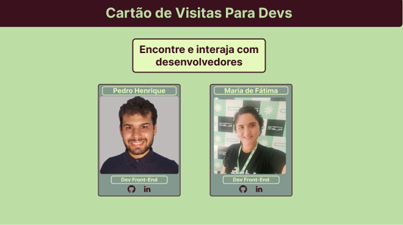

# Visit Card

Bem-vindo ao **Visit Card**, um cartão de visitas digital feito especialmente para desenvolvedores! Este projeto tem como objetivo apresentar, de forma moderna e acessível, informações profissionais como nome, cargo e redes sociais.

## Sobre o Projeto

O **Visit Card** é um projeto simples, mas poderoso, que permite a desenvolvedores se apresentarem com estilo em uma página única. Este projeto foi desenvolvido como parte do **Desafio #1 do Orion**, iniciativa do grupo de estudos em **Frontend**, que busca incentivar a prática de habilidades usando tecnologias modernas por meio de desafios criativos e colaborativos.

## Funcionalidades

- Exibição de informações básicas do desenvolvedor
- Links para redes sociais (GitHub, LinkedIn, etc.)
- Layout responsivo e visual moderno
- Design personalizável para diferentes estilos

## Tecnologias Utilizadas

- HTML5
- CSS3
- JavaScript
- React

## Como Rodar o Projeto

1. Clone este repositório:
   ```bash
   git clone https://github.com/seu-usuario/visit-card.git

2. Navegue até o diretório do projeto:

```cd visit-card```

3. Vá ate o terminal e digite o seguinte comando para instalar as dependências:
```npm install```

4. Execute a aplicação
```npm run dev```

# Protótipo



# Integrantes do Projeto

**Pedro Henrique Feliciano da Silva**  
**Desenvolvedor Frontend**  
[](https://github.com/PedroHKarate)

**Maria de Fátima Nunes Alves**  
**Desenvolvedora Frontend**  
[](https://github.com/alvesmariadefatima)
